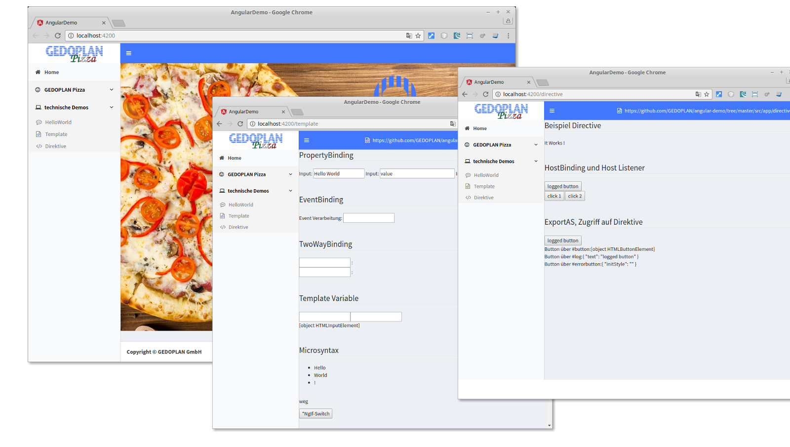

# Angular Demo
 - Angular-CLI
 - Property Binding
 - Event Binding
 - TwoWayBinding
 -  Template Variable
 - Micro Syntax
 - @Input und @Output Decorator
 - Content Insertion
 - ContentChildren
 - Lifecycle Methoden
 - HostBinding und HostListener
 - NgTempPlateOutlet
 - NgTemplateRef
 - ViewContainerRef
 - ComponentFactory
 - Dependency Injection
 - TemplateDriven Forms
 - ModelDriven Forms
 - Router / Navigation
 - HTTP
 - Testing, Karma / Jasmine
 - Module, LazyLoading
 - i18n, Internationalisierung



# Run 
npm start

```
by Dominik Mathmann
```
